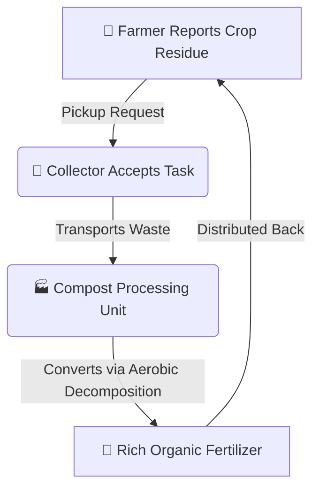

# 🌱 AgroLoop — Smart Agricultural Waste Management Platform

[](https://opensource.org/licenses/MIT)
[](https://nodejs.org/)
[](https://react.dev/)
[](https://vitejs.dev/)
[](https://www.mongodb.com/)

> **AgroLoop** is a sustainable circular-economy platform designed to tackle stubble burning and agricultural crop waste. It seamlessly connects **Farmers**, **Waste Collectors**, **Compost Processing Units**, and **System Administrators** to transform crop residue into nutrient-rich organic fertilizer.

---

## 📌 Problem Statement & Vision

**Stubble burning** releases severe atmospheric pollutants (PM2.5, CO₂, CO, methane) every harvesting season, depleting soil fertility and damaging public health. 

**AgroLoop** closes the loop on agricultural waste by creating a tech-driven supply chain:
1. **Farmers** log crop residue for collection instead of burning it.
2. **Collectors** accept logistics orders and transport waste from fields.
3. **Compost Units** convert raw agricultural waste into organic bio-fertilizer.
4. **Farmers & Agri-businesses** purchase back affordable organic fertilizer to replenish soil health.

---

## ✨ Key Features & User Roles

### 🧑‍🌾 1. Farmer Dashboard
* **Waste Pickup Request**: Submit crop type, estimated quantity (in tons), location, and preferred pickup date.
* **Real-time Status Tracking**: Follow pickup requests across 6 live stages with visual progress bars.
* **Eco-Points & Rewards**: Earn green incentives and Eco-Points for every ton of waste diverted from burning.
* **Impact Counter**: View personalized metrics on CO₂ emissions prevented and soil saved.

### 🚚 2. Collector Dashboard
* **Logistics Queue**: Accept available crop waste collection tasks filtered by location/district.
* **Status Updates**: Update logistics stages (*Assigned*, *En Route / In Progress*, *Delivered*).
* **Vehicle Fleet Specs**: Track payload capacities and vehicle logs.

### 🏭 3. Compost Unit Dashboard
* **Waste Intake Management**: Receive incoming raw organic matter batches from collectors.
* **Decomposition Cycle Monitoring**: Track curing temperatures, moisture levels, and processing timelines.
* **Inventory & Yield Logging**: Record output tons of finished bio-compost and distribute to markets.

### 🛡️ 4. Admin Dashboard
* **System Metrics**: Overview of total waste collected, active requests, and verified users.
* **User Management**: Approve and verify accounts for Farmers, Collectors, and Processing Units.
* **Environmental Analytics**: Aggregate metrics on prevented emissions and regional participation.

---

## 🛠️ Technology Stack

| Layer | Technologies Used |
| :--- | :--- |
| **Frontend** | React 18, Vite, Tailwind CSS, Lucide Icons, Context API |
| **Backend** | Node.js, Express.js, CORS, Dotenv |
| **Database** | MongoDB, Mongoose ODM |
| **Tooling & Code Quality** | npm workspaces, Oxlint, Git |

---

## 📂 Project Architecture

```
AgroLoop/
├── backend/
│   ├── routes/
│   │   ├── authRoutes.js       # User Authentication & Verification
│   │   └── requestRoutes.js    # Waste Pickup Requests & Tracking APIs
│   ├── package.json
│   └── server.js               # Express Server Entry Point
│
├── database/
│   ├── config/
│   │   └── db.js               # MongoDB Connection Handler
│   └── models/
│       ├── User.js             # Schema for Farmers, Collectors, Compost Units & Admins
│       └── WasteRequest.js     # Schema for Pickup Requests & Timeline Tracking
│
├── frontend/
│   ├── public/                 # Static Assets & Icons
│   ├── src/
│   │   ├── assets/             # Branding Images & Graphics
│   │   ├── components/
│   │   │   ├── common/         # Reusable Components (Toast, ImpactCounter, Notifications)
│   │   │   └── layout/         # Navigation & Footer Components
│   │   ├── context/            # React Context (State Management & Auth)
│   │   ├── data/               # Mock Datasets & Initial State
│   │   ├── pages/              # Main App Pages (Home, About, Services, Tracking, Contact, Feedback)
│   │   │   └── dashboards/     # Role-specific Dashboards (Farmer, Collector, Compost, Admin)
│   │   ├── App.jsx             # Main Application Component & Page Router
│   │   ├── main.jsx            # React App Mounting
│   │   └── index.css           # Global Styling & Tailwind Directives
│   ├── package.json
│   └── vite.config.js
│
├── .gitignore
├── package.json                # Root package.json (Unified scripts)
└── README.md
```

---

## 🚀 Getting Started

### Prerequisites
Make sure you have the following installed on your machine:
* [Node.js](https://nodejs.org/) (v18.0.0 or higher)
* [npm](https://www.npmjs.com/) (v9.0.0 or higher)
* [MongoDB](https://www.mongodb.com/) (Local instance or MongoDB Atlas URI)

### 1. Clone the Repository
```bash
git clone https://github.com/DollySravyaSagi/AgroLoop.git
cd AgroLoop
```

### 2. Install Dependencies

Install dependencies for the root, frontend, and backend packages:
```bash
# Install backend dependencies
cd backend
npm install

# Install frontend dependencies
cd ../frontend
npm install

# Return to root directory
cd ..
```

### 3. Environment Setup

Create a `.env` file inside the `backend/` directory:

```env
PORT=5000
MONGO_URI=mongodb://localhost:27017/agroloop
JWT_SECRET=your_secret_key_here
```

### 4. Running the Application

You can start both frontend and backend concurrently or independently:

#### Start Frontend Only (Vite Dev Server):
```bash
npm run dev:frontend
```
*App will run at:* `http://localhost:5173`

#### Start Backend Server Only (Node.js/Express):
```bash
npm run dev:backend
```
*API will run at:* `http://localhost:5000`

---

## 📡 API Reference Endpoint Summary

| Method | Endpoint | Description | Access |
| :--- | :--- | :--- | :--- |
| `POST` | `/api/auth/register` | Register new User (Farmer / Collector / Compost Unit / Admin) | Public |
| `POST` | `/api/auth/login` | Authenticate User & return session info | Public |
| `GET` | `/api/auth/users` | Fetch all registered users | Admin |
| `POST` | `/api/requests` | Submit new crop waste pickup request | Farmer |
| `GET` | `/api/requests` | Fetch all waste pickup requests | All Roles |
| `GET` | `/api/requests/:id` | Fetch specific waste request timeline details | All Roles |
| `PUT` | `/api/requests/:id/status` | Update pickup status & timeline step | Collector / Admin / Compost Unit |
| `GET` | `/api/health` | API Health Check | Public |

---

## 📊 Environmental Impact & Circular Workflow



---

## 🤝 Contributing

Contributions are welcome! To contribute to **AgroLoop**:
1. Fork the Repository.
2. Create a Feature Branch (`git checkout -b feature/AmazingFeature`).
3. Commit your Changes (`git commit -m 'Add some AmazingFeature'`).
4. Push to the Branch (`git push origin feature/AmazingFeature`).
5. Open a Pull Request.

---

## 📄 License

Distributed under the MIT License. See `LICENSE` for more information.

---

<p center="align">
  <b>Built with 🌱 for a greener, stubble-burn-free future.</b>
</p>
